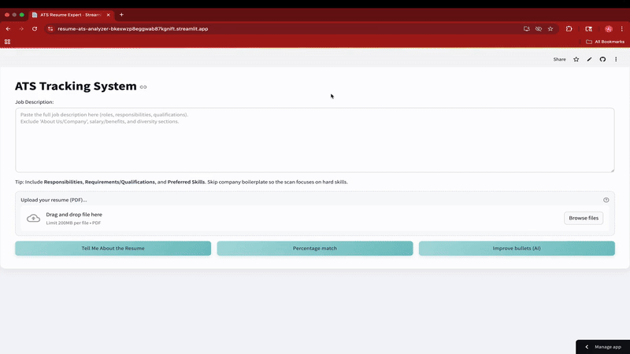

# 📊 Resume ATS Analyzer  

A **Streamlit-based AI-powered application** that analyzes resumes against job descriptions and provides **ATS-friendly scoring** along with actionable insights.  

---

## ⚡ Overview  
This tool helps **job seekers, students, and professionals** understand how well their resume matches a given job description.  
It leverages **AI + ATS-style parsing** to generate insights, highlight missing skills, and suggest improvements.  

It provides two unique scoring mechanisms:  
- **Gemini AI Score** → AI-based semantic alignment between Resume and Job Description.  
- **Graph Score** → Visualization of keyword and skills match ratio.  

---

## 🛠 Tech Stack  
- **Python** – Core programming language.  
- **Streamlit** – Interactive web UI framework.  
- **Google Generative AI (Gemini API)** – AI-based text evaluation & bullet point suggestions.  
- **NLP & Regex** – Text parsing and keyword extraction.  
- **Matplotlib** – Resume–JD alignment visualization.  

---

## ✨ Features  
✅ Upload your **resume (PDF)** and provide a **job description**.  
✅ **AI-Tailored Bullet Suggestions** → Auto-generated improvements to strengthen your resume.  
✅ **Percentage Match Score** → Understand how closely your resume aligns with the JD.  
✅ **Skill Gap Analysis** → Highlights missing keywords and critical skills.  
✅ **Visualization** → Pie/Bar chart showing resume vs. JD keyword coverage.  
✅ **User-Friendly Interface** → No coding required, just upload and analyze!  

---

## 🔄 Workflow  
1. **Upload Resume (PDF)**.  
2. **Paste Job Description** into the input box.  
3. **AI Parsing** extracts experience, skills, and education.  
4. **Gemini API** evaluates resume–JD match and generates bullet suggestions.  
5. **Graphical Visualization** shows keyword coverage.  
6. **Actionable Insights** guide you to improve your resume.  

---

## 📂 Input & Output  

### Input  
- Resume (PDF, max 200MB)  
- Job description (plain text)  

### Output  
- AI Score (%)  
- Graph Score (%)  
- Suggested resume bullet points  
- Missing skills/keywords list  
- Visual report (matplotlib graph)  

---

## 🎥 Live Demo  

  

---

## 🎯 Use Cases  
- **Job Seekers** → Optimize resumes for ATS & recruiters.  
- **Students/Graduates** → Improve resumes for internships & first jobs.  
- **Career Coaches** → Provide clients with AI-backed resume improvement suggestions.  
- **Recruiters/HR** → Quickly evaluate candidate alignment.  

---

## 📌 Future Enhancements  
- Export **AI-enhanced resume PDF** directly.  
- Multi-language resume analysis.  
- Integration with **LinkedIn profiles**.  
- Advanced **semantic similarity scoring**.  
